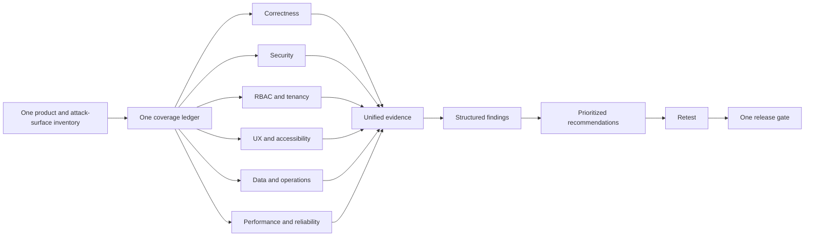
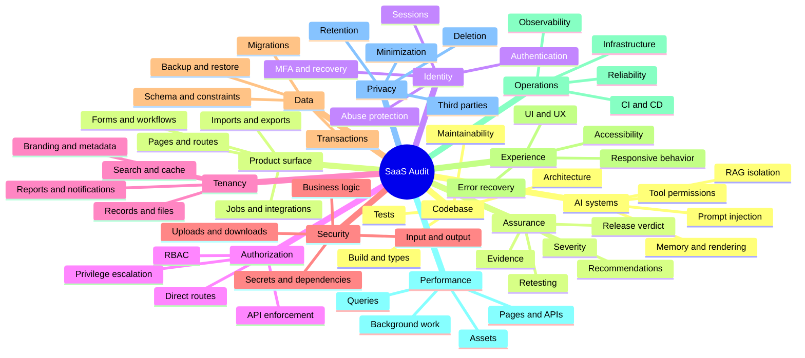
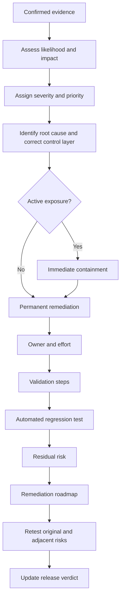
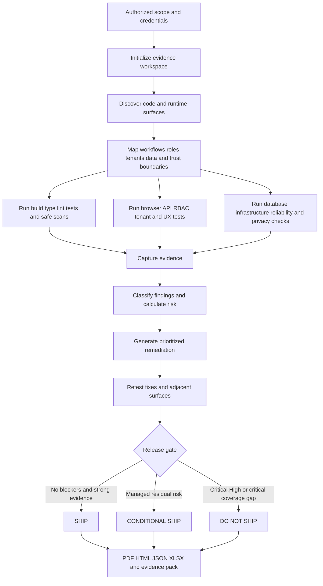
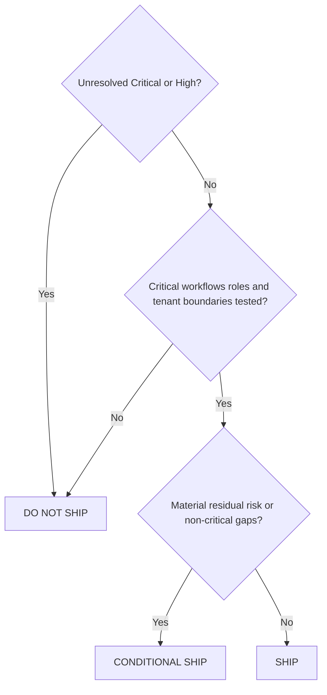

# SaaS Audit

> **Designed to be the world's most efficient evidence-driven codebase and SaaS audit skill.**

[](LICENSE.md)
[](CHANGELOG.md)
[](SKILL.md)
[](SECURITY.md)
[](https://linkedin.com/in/srksourabh)

`saas-audit` turns Claude Code, Codex, Hermes, Anti-Gravity, VS Code/GitHub Copilot-compatible agents and other Agent Skills clients into a structured release-assurance team.

It audits the codebase and authorized running application, proves findings with evidence, explains how each issue affects product quality, recommends the smallest durable repair, defines validation and regression protection, retests fixes and produces a final:

- `SHIP`
- `CONDITIONAL SHIP`
- `DO NOT SHIP`

The skill is designed for authorized testing only. It prohibits destructive exploitation, denial-of-service, uncontrolled load, persistence, credential stuffing, data exfiltration and production changes without explicit approval.

## Why it is efficient

Most audits repeat discovery separately for code, security, QA, UX, data and infrastructure. `saas-audit` creates one inventory, one coverage ledger, one evidence model, one finding schema and one remediation roadmap. Each discovered route, API, workflow or data object is reused across all applicable quality domains.



Efficiency does not mean shallow coverage. It means eliminating duplicate work while keeping every claim traceable to executed tests.

## What the skill checks



## Audit coverage, quality impact and suggestions

| Domain | What is checked | How quality improves | Typical suggestions |
|---|---|---|---|
| Discovery | Routes, pages, APIs, jobs, roles, tenants, data stores, infrastructure and hidden surfaces | Prevents untested or unowned functionality from escaping review | Reconcile source/runtime inventory, remove dead paths, document hidden endpoints, assign owners |
| Codebase quality | Build, types, lint, tests, architecture, duplication, coupling, errors and documentation | Makes changes safer and easier to maintain | Simplify boundaries, centralize repeated logic, remove dead code, add critical-path tests |
| Authentication | Login, passwords, reset, MFA, lockout, cookies, sessions, logout and revocation | Reduces account takeover and stale-session risk | Rotate sessions, shorten reset lifetime, add throttling, harden cookies, require privileged MFA |
| RBAC | Expected-versus-actual permissions through UI, direct routes and APIs | Prevents unauthorized actions hidden behind front-end controls | Centralize policies, deny by default, enforce server-side, add role-action contract tests |
| Multi-tenancy | Records, IDs, files, search, exports, cache, logs, jobs, reports, branding and vector stores | Prevents the highest-impact SaaS confidentiality failures | Scope every query/key/path/job, enforce RLS, redact errors, add two-tenant regression tests |
| Functional QA | Positive, negative, boundary, duplicate, interrupted, concurrent, retry and recovery behavior | Reduces production defects and inconsistent workflows | Add idempotency, transactions, validation, draft recovery and duplicate protection |
| UI/UX | Navigation, hierarchy, actions, consistency, feedback, errors and responsive states | Reduces user mistakes, support load and completion time | Standardize components, clarify actions, improve states, remove unnecessary steps |
| Accessibility | Keyboard, focus, semantics, labels, contrast, zoom, touch targets and dynamic announcements | Makes the application usable by more people | Use native controls, repair focus, label inputs, announce status, add accessibility tests |
| Application security | Injection, XSS, CSRF, redirect/SSRF indicators, disclosures, uploads and business logic | Reduces exploitable application risk | Validate trust boundaries, encode output, authorize files, remove secrets, add anti-replay controls |
| API quality and security | Authentication, object/function authorization, schemas, exposure, limits, CORS, replay and versioning | Protects the system below the UI and stabilizes integrations | Publish contracts, reject unknown fields, scope objects, standardize errors, define deprecation |
| Database integrity | Constraints, relationships, precision, time zones, transactions, concurrency, RLS and queries | Prevents silent corruption and inconsistent records | Add constraints, transactions, locking, reconciliation, indexes and tenant policies |
| Migrations | Compatibility, locks, backfills, validation, rollback and partial execution | Reduces release-related data loss and downtime | Use expand-contract, rehearse migrations, validate data, document rollback/forward-fix |
| Files, cache and search | Authorization, tenant keys, signed URLs, expiry, invalidation and indexing | Prevents indirect leakage and stale access | Scope keys and paths, shorten URL lifetime, test invalidation, propagate deletion |
| Jobs and integrations | Queues, cron, webhooks, retries, duplicates, tenant context and reconciliation | Improves asynchronous correctness and recovery | Add idempotency, backoff, dead-letter queues, signatures, runbooks and reconciliation |
| Supply chain | Dependencies, lockfiles, vulnerabilities, provenance, licenses, SBOM and secrets | Reduces dependency and build-chain risk | Pin packages, prioritize reachable risk, scan artifacts, rotate secrets, maintain SBOM |
| CI/CD and infrastructure | Workflow permissions, environments, IaC, cloud, containers, deployment and rollback | Makes releases repeatable, controlled and recoverable | Least privilege, protected environments, image scans, smoke tests and rollback rehearsal |
| Reliability | Timeouts, retries, races, degradation, backup, restore, RTO/RPO and disaster recovery | Reduces incidents and recovery time | Add failure isolation, retry budgets, restore tests, runbooks and recovery ownership |
| Observability | Logs, metrics, traces, alerts, correlation IDs and operational ownership | Improves detection and diagnosis | Structured logs, redaction, SLOs, actionable alerts, traces and runbooks |
| Performance | Page/API latency, queries, bundles, requests, search, exports and uploads | Improves responsiveness, scalability and cost efficiency | Remove N+1, paginate, compress, cache safely, defer work, add performance budgets |
| Privacy | Collection, consent, retention, deletion, masking, logs and third parties | Reduces unnecessary data exposure | Classify data, minimize collection, enforce retention, mask logs, test deletion |
| AI/LLM | Prompt injection, tools, permissions, RAG/vector isolation, memory and output rendering | Limits model-driven disclosure and privilege risk | Isolate retrieval, validate tool arguments, require confirmation, sanitize output, test adversarial prompts |
| Release assurance | Evidence, severity, recommendations, retesting, residual risk and verdict | Replaces subjective approval with traceable decision support | Block unresolved Critical/High risk, assign owners, validate fixes, automate regressions |

Read the complete [feature guide](docs/FEATURES.md), [quality-impact guide](docs/QUALITY-IMPACT.md) and [recommendation engine](docs/RECOMMENDATIONS.md).

## How recommendations are generated



Every material suggestion should contain:

1. the observed defect and evidence;
2. the technical and business impact;
3. the root cause where supported;
4. immediate containment for active exposure;
5. the smallest durable permanent fix;
6. stack-compatible implementation guidance;
7. accountable owner and effort;
8. exact validation steps;
9. automated regression protection;
10. residual risk after remediation.

The skill rejects generic recommendations such as “improve security,” “add validation” or “write more tests” unless they are converted into specific, executable controls.

## Complete audit workflow



## Operating modes

1. **Code audit** — codebase, architecture, tests, dependencies, migrations, CI/CD and infrastructure.
2. **Black-box audit** — authorized deployed application through browser and APIs.
3. **Hybrid audit** — correlates source, database, APIs, logs and runtime behavior. Recommended.
4. **Focused audit** — one module or workflow with its security, RBAC, tenancy, data and regression boundaries.
5. **Release gate** — retests blockers and issues a final verdict.

## Install

Clone the standalone repository:

```bash
git clone https://github.com/srksourabh/saas-audit.git
cd saas-audit
```

macOS, Linux, WSL or Git Bash:

```bash
./install.sh
```

Project-level installation:

```bash
./install.sh --project
```

Windows PowerShell:

```powershell
.\install.ps1
```

Project-level installation:

```powershell
.\install.ps1 -Project
```

See the complete [installation guide](docs/INSTALLATION.md).

## Use

```text
Use the saas-audit skill to perform a complete hybrid pre-release audit of this repository and the authorized staging application.

Audit the codebase, authentication, server-side RBAC, tenant isolation, critical workflows, UI/UX, accessibility, application and API security, database integrity, migrations, storage, dependencies, CI/CD, infrastructure, reliability, observability, performance, privacy and AI/LLM features.

Use two tenants and every available role. Capture screenshots and technical evidence. For each finding, explain quality impact, immediate containment, permanent fix, owner, effort, validation, regression test and residual risk. Retest fixes and issue SHIP, CONDITIONAL SHIP or DO NOT SHIP.
```

More prompts: [Usage Guide](docs/USAGE.md).

## Output

```text
saas-audit-output/
├── reports/
│   ├── <app>_Holistic_SaaS_Audit_Report_<date>.pdf
│   ├── <app>_Holistic_SaaS_Audit_Report_<date>.html
│   └── <app>_Release_Verdict_<date>.md
├── data/
│   ├── <app>_Audit_Findings_<date>.json
│   ├── <app>_Detailed_Audit_Findings_<date>.xlsx
│   ├── <app>_RBAC_Matrix_<date>.xlsx
│   ├── coverage.json
│   └── evidence-index.json
├── evidence/<domain>/
├── logs/<app>_Audit_Execution_Log_<date>.md
└── manifest.json
```

Read [Evidence, Scoring and Reporting](docs/REPORTING.md).

## Release gate



A high score cannot compensate for blocked or untested critical coverage. Human release authorization remains mandatory.

## Repository structure

```text
saas-audit/
├── SKILL.md
├── README.md
├── LICENSE.md
├── CHANGELOG.md
├── SECURITY.md
├── SUPPORT.md
├── CODE_OF_CONDUCT.md
├── install.sh
├── install.ps1
├── assets/
│   ├── audit-config.example.yaml
│   └── finding.schema.json
├── scripts/
│   ├── init_audit.py
│   ├── validate_findings.py
│   └── render_report.py
├── references/
│   ├── execution-playbook.md
│   ├── security-rbac-tenancy.md
│   ├── quality-ux-accessibility.md
│   ├── data-api-infrastructure.md
│   ├── evidence-reporting-release.md
│   ├── master-audit-checklist.md
│   └── platform-installation.md
└── docs/
    ├── FEATURES.md
    ├── ARCHITECTURE.md
    ├── QUALITY-IMPACT.md
    ├── RECOMMENDATIONS.md
    ├── INSTALLATION.md
    ├── USAGE.md
    ├── REPORTING.md
    ├── TROUBLESHOOTING.md
    └── CONTRIBUTING.md
```

## Documentation

- [Core Agent Skill](SKILL.md)
- [Detailed Features](docs/FEATURES.md)
- [Architecture and Workflow](docs/ARCHITECTURE.md)
- [How Quality Improves](docs/QUALITY-IMPACT.md)
- [Recommendation Engine](docs/RECOMMENDATIONS.md)
- [Installation](docs/INSTALLATION.md)
- [Usage and Prompt Library](docs/USAGE.md)
- [Evidence, Scoring and Reporting](docs/REPORTING.md)
- [Troubleshooting](docs/TROUBLESHOOTING.md)
- [Contributing](docs/CONTRIBUTING.md)
- [Master Audit Checklist](references/master-audit-checklist.md)
- [Security Policy](SECURITY.md)
- [Support](SUPPORT.md)
- [Code of Conduct](CODE_OF_CONDUCT.md)
- [Changelog](CHANGELOG.md)

## Safety and limitations

Use only on applications, repositories and infrastructure you are authorized to test. Never commit credentials. Prefer environment variables and dedicated test accounts. Review scripts before granting terminal, browser, database, cloud or infrastructure access.

The skill improves consistency and release confidence but does not replace independent professional penetration testing, legal advice, formal compliance certification, production-owner approval or human accountability. Coverage depends on available source, environments, roles, tenants, data, tools and permissions.

## License

[MIT](LICENSE.md). Prepared by **Sourabh Bhaumik**.
