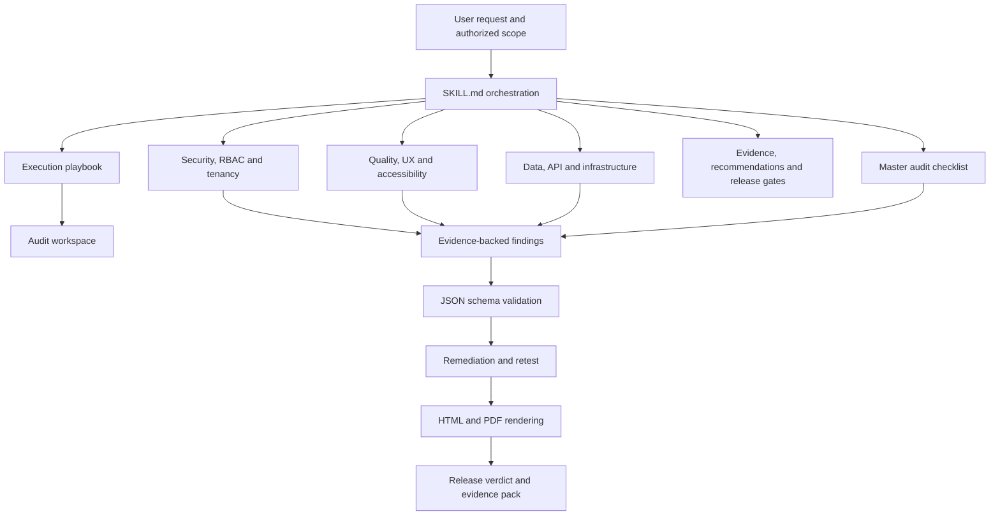
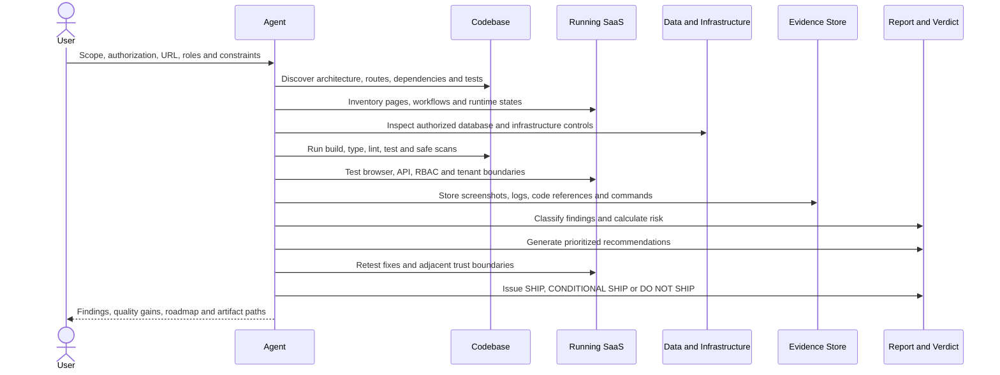
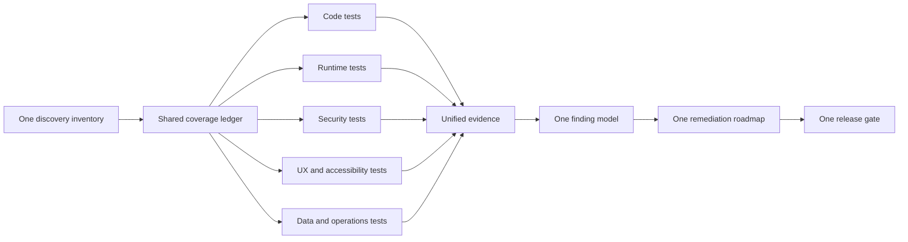
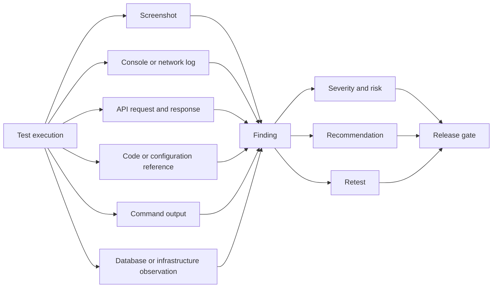
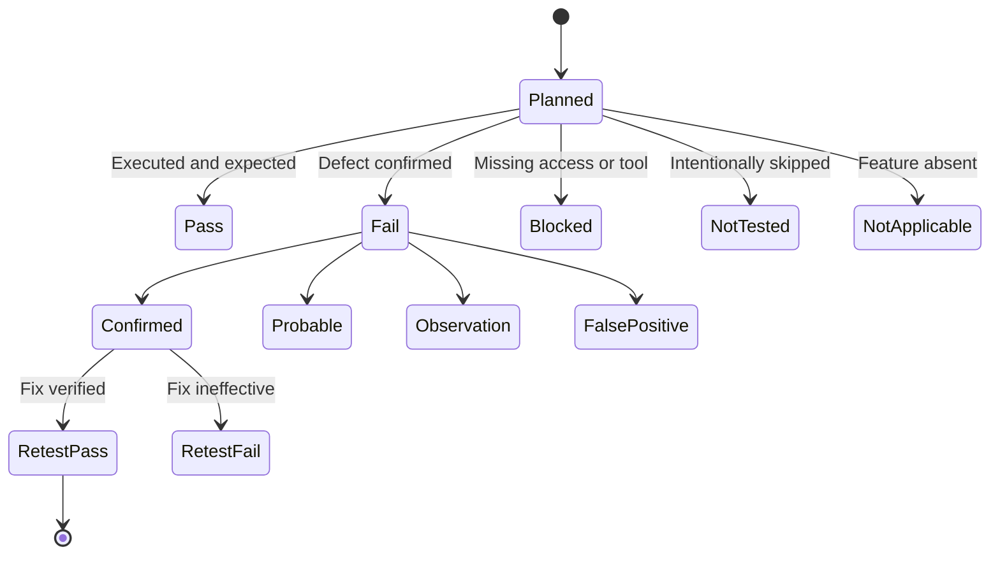

# Architecture and Workflow

## Design goal

`saas-audit` is structured for progressive disclosure: a compact `SKILL.md` controls execution, while specialized references are loaded only when the active audit phase needs them. This reduces context overhead and avoids repeating the same instructions.

## Skill architecture

## End-to-end audit sequence

## Efficiency model

The skill avoids duplicated effort by using one surface inventory, one evidence model, one severity system and one release decision. A route discovered during functional QA is reused for authorization, tenancy, accessibility, performance and regression coverage.

## Evidence model

## Trust boundaries

The audit treats each of these as an explicit boundary:

- anonymous visitor to authenticated application;
- user to user;
- lower role to privileged role;
- tenant to tenant;
- browser to API;
- API to database, storage, cache and queues;
- application to third-party services;
- CI/CD to production;
- human instruction to AI agent;
- model output to tool execution;
- untrusted documents to RAG and vector memory.

## Test and finding states

## Non-negotiable design principles

1. Evidence before claims.
2. Server-side enforcement before UI assumptions.
3. Tenant isolation across every shared subsystem.
4. Safe, non-destructive testing.
5. Explicit limitations and blocked coverage.
6. Critical and High findings block release by default.
7. Recommendations must include validation and regression tests.
8. Human release authorization remains mandatory.
