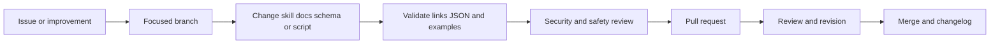

# Contributing

Contributions are welcome when they make the skill more accurate, evidence-driven, safe, portable or efficient.

## Contribution principles

1. Preserve non-destructive and authorized testing boundaries.
2. Prefer evidence and reproducible checks over broad assertions.
3. Keep `SKILL.md` compact; place detail in progressive reference files.
4. Avoid tool- or stack-specific assumptions in the core unless necessary.
5. Never weaken a release gate, authorization control or validation to make an example pass.
6. Do not claim compliance, certification, zero risk or complete coverage.
7. Add validation and regression guidance for new checks.
8. Keep documentation useful even when Mermaid rendering is unavailable.

## Contribution flow

## Types of contribution

- new audit checks or threat patterns;
- stronger RBAC or tenant-isolation tests;
- stack-specific examples that remain clearly optional;
- evidence and reporting improvements;
- installer portability;
- validation or report tooling;
- accessibility and UX coverage;
- AI/LLM and agent-security checks;
- documentation, Mermaid diagrams and troubleshooting;
- false-positive reduction and efficiency improvements.

## File placement

| Change | Location |
|---|---|
| Core orchestration or non-negotiable rule | `SKILL.md` |
| Domain execution detail | `references/` |
| User-facing explanation or tutorial | `docs/` |
| Machine-readable contract or example configuration | `assets/` |
| Portable helper | `scripts/` |
| Installation | `install.sh`, `install.ps1`, `docs/INSTALLATION.md` |
| Release history | `CHANGELOG.md` |

## Adding an audit check

A new check should define:

- objective and risk addressed;
- preconditions and authorization needs;
- safe execution steps;
- expected behavior;
- evidence to capture;
- pass, fail, blocked and not-applicable criteria;
- severity guidance;
- likely root causes;
- remediation categories;
- validation and regression approach;
- limitations and false-positive risks.

## Documentation quality

Use direct headings, short paragraphs, tables where comparisons matter and Mermaid only where a diagram improves comprehension. Keep terminology consistent:

- `SaaS Audit` for the product;
- `saas-audit` for the skill and repository;
- `Critical/P0` through `Informational/P4`;
- `SHIP`, `CONDITIONAL SHIP`, `DO NOT SHIP`;
- `PASS`, `FAIL`, `BLOCKED`, `NOT_TESTED`, `NOT_APPLICABLE`.

## Validation checklist

Before opening a pull request:

- [ ] `SKILL.md` has valid frontmatter and `name: saas-audit`.
- [ ] Every relative Markdown link resolves.
- [ ] JSON files parse successfully.
- [ ] Python helpers run with `--help`.
- [ ] Shell and PowerShell examples are syntactically reasonable.
- [ ] No credentials, tokens, cookies or private data are included.
- [ ] New claims are supported or clearly framed as design goals.
- [ ] New checks remain non-destructive by default.
- [ ] README and changelog are updated when user-visible behavior changes.

## Versioning

Use semantic versioning:

- patch: corrections, documentation and compatible check refinement;
- minor: new compatible audit domains, artifacts or helpers;
- major: incompatible skill contract, schema or installation changes.

## Pull request description

Explain what changed, why, user impact, safety implications, validation performed and any known limitation. Keep unrelated changes in separate pull requests.
