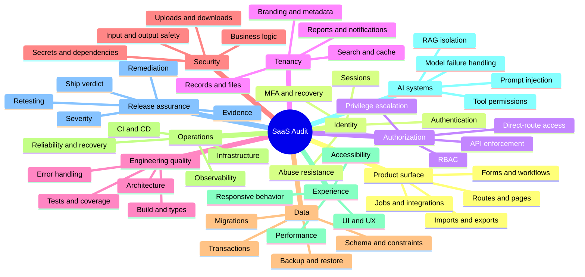
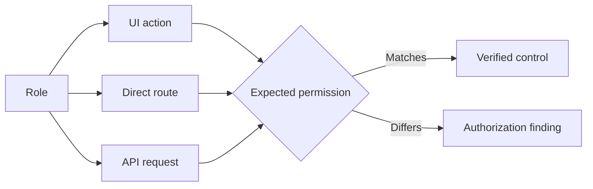

# Detailed Audit Features

`saas-audit` is designed to be the world's most efficient evidence-driven codebase and SaaS audit skill. Efficiency here means maximum risk discovery and release confidence with minimum duplicated work, while never claiming a test passed unless it was executed.

## Coverage map

## 1. Complete application discovery

The skill builds a testable inventory before judging quality. It identifies public and authenticated routes, menus, tabs, modals, forms, tables, filters, reports, uploads, downloads, exports, API operations, WebSockets, webhooks, queues, scheduled jobs, roles, permissions, tenants, database objects, storage, infrastructure and AI features.

**Quality improvement:** prevents hidden, orphaned or undocumented surfaces from escaping the audit.

**Typical suggestions:** remove dead routes, document hidden endpoints, align runtime routes with source manifests, assign owners to unowned jobs and add coverage for newly discovered surfaces.

## 2. Authentication and session security

Checks valid and invalid login, password policy, reset tokens, MFA, account lockout, cookies, browser storage, idle timeout, absolute timeout, logout invalidation, concurrent sessions and session behavior after password or role changes.

**Quality improvement:** reduces account takeover, stale-session and identity lifecycle risk.

**Typical suggestions:** rotate sessions after privilege changes, use secure cookie flags, shorten reset-token lifetime, add throttling, invalidate sessions after password reset and add MFA for privileged roles.

## 3. RBAC and server-side authorization

Produces an expected-versus-actual permission matrix across view, create, update, delete, approve, reject, assign, import, export, download, configure, invite, archive, restore, impersonate and sensitive-field access.

**Quality improvement:** detects authorization gaps hidden by front-end controls.

**Typical suggestions:** centralize policy enforcement, deny by default, scope queries server-side, add permission tests and eliminate duplicate permission logic.

## 4. Multi-tenant and white-label isolation

Tests whether tenants can discover each other through records, IDs, names, domains, logos, users, filenames, reports, exports, search, autocomplete, notifications, emails, webhooks, caches, CDN paths, logs, analytics, queues, search indexes and vector stores.

**Quality improvement:** protects confidentiality and prevents the highest-impact SaaS isolation failures.

**Typical suggestions:** include tenant IDs in every storage and cache key, enforce row-level policies, remove tenant metadata from errors, scope background jobs and add two-tenant regression tests.

## 5. Functional correctness

Runs positive, negative, boundary, malformed, duplicate, interrupted, concurrent, retry and recovery scenarios across CRUD, bulk actions, validations, imports, exports, filters, pagination, notifications and business rules.

**Quality improvement:** catches defects beyond the happy path and improves workflow resilience.

**Typical suggestions:** make operations idempotent, add transactional boundaries, improve validation messages, preserve drafts, prevent duplicate submissions and test recovery paths.

## 6. UI, UX and usability

Reviews navigation, action clarity, naming, hierarchy, feedback, empty/loading/error/success states, destructive actions, cognitive load, consistency, mobile behavior and first-time-user experience.

**Quality improvement:** reduces user errors, support burden and task completion time.

**Typical suggestions:** standardize components, clarify primary actions, add confirmation only where risk justifies it, improve empty states and reduce unnecessary steps.

## 7. Accessibility

Reviews keyboard navigation, focus order, focus visibility, labels, semantic HTML, headings, landmarks, ARIA, contrast, zoom, touch targets, modals, dynamic announcements and accessible data tables.

**Quality improvement:** makes the product usable by more people and reduces avoidable compliance-readiness gaps.

**Typical suggestions:** use native controls, restore focus after modals, associate labels, expose status messages and add automated plus manual accessibility checks.

## 8. Application and business-logic security

Safely checks injection, XSS, CSRF, redirects, SSRF indicators, security headers, debug disclosure, source maps, browser storage, uploads, downloads, transaction duplication and workflow bypass.

**Quality improvement:** detects exploitable weaknesses while preserving service availability and data integrity.

**Typical suggestions:** validate at trust boundaries, encode output by context, authorize file access, remove secrets from clients, add anti-replay controls and simplify dangerous workflows.

## 9. API assurance

Evaluates authentication, object and function authorization, schemas, mass assignment, excessive data exposure, pagination, rate limits, CORS, content types, idempotency, replay resistance, versioning and deprecated endpoints.

**Quality improvement:** protects the system beneath the UI and improves contract stability.

**Typical suggestions:** publish an API contract, reject unknown fields, use consistent errors, add object-level authorization tests and define deprecation policy.

## 10. Database and data integrity

Checks constraints, nulls, uniqueness, relationships, precision, time zones, transactions, retries, partial writes, orphan records, soft deletion, restoration, tenant scoping, row-level security, migrations, backups and sensitive-field protection.

**Quality improvement:** prevents silent corruption, inconsistent records and unsafe releases.

**Typical suggestions:** move critical rules into constraints, wrap related writes in transactions, add migration dry runs, test restore procedures and document ownership.

## 11. Supply chain and infrastructure

Reviews vulnerable dependencies, lockfiles, secrets, provenance, licenses, SBOM readiness, CI/CD permissions, environment separation, branch protection, cloud configuration, IaC, containers, deployment and rollback.

**Quality improvement:** reduces software supply-chain and operational release risk.

**Typical suggestions:** pin dependencies, minimize workflow permissions, scan images, use protected environments, rotate exposed secrets and rehearse rollback.

## 12. Reliability, resilience and observability

Covers retries, idempotency, duplicate jobs, poison messages, webhook replay, cron overlap, stale writes, race conditions, optimistic locking, graceful degradation, structured logs, metrics, traces, alerts, backup restore, RTO and RPO.

**Quality improvement:** reduces incident frequency and time to recovery.

**Typical suggestions:** add correlation IDs, dead-letter queues, SLOs, actionable alerts, runbooks, retry budgets and failure-injection tests.

## 13. Performance

Examines page load, API latency, slow queries, bundles, duplicate requests, oversized assets, search, exports, uploads and safe slow-network behavior.

**Quality improvement:** improves responsiveness, scalability and infrastructure efficiency.

**Typical suggestions:** remove N+1 queries, paginate data, compress assets, cache safely, defer non-critical work and create performance budgets.

## 14. Privacy and compliance readiness

Reviews minimization, consent, retention, deletion, correction, masking, logs, exports, third parties, encryption and backup retention. It never claims legal compliance or certification.

**Quality improvement:** reduces unnecessary data exposure and makes formal review easier.

**Typical suggestions:** document data flows, enforce retention, mask logs, test deletion, classify data and maintain processor records.

## 15. AI and LLM systems

Checks prompt injection, unsafe tools, excessive permissions, untrusted documents, RAG and vector isolation, tenant memory, sensitive-data leakage, unsafe output rendering and model failure behavior.

**Quality improvement:** limits model-driven privilege, disclosure and cross-tenant risk.

**Typical suggestions:** isolate retrieval by tenant, validate tool arguments, require confirmation for irreversible actions, sanitize rendered output and evaluate adversarial prompts.

## 16. Evidence and release gate

Every confirmed issue includes reproducible steps, evidence, severity, likelihood, technical impact, business impact, root cause, immediate containment, permanent remediation, owner, effort, validation and regression testing.

The final outcome is:

- `SHIP` — required evidence passes and no blocker remains.
- `CONDITIONAL SHIP` — manageable residual risk with explicit owners and controls.
- `DO NOT SHIP` — unresolved blocker, severe exposure, unsafe migration, failed critical checks or untested critical workflow.
