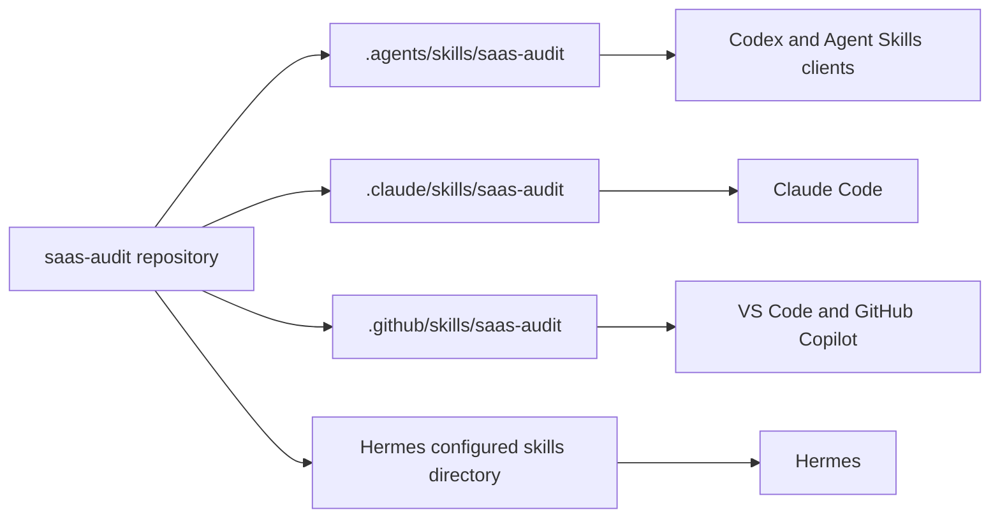

# Installation Guide

Copy the complete repository because `SKILL.md` depends on `references`, `assets`, `scripts` and `docs`.

## Supported clients



## Clone

```bash
git clone https://github.com/srksourabh/saas-audit.git
cd saas-audit
```

## Automatic installation

### macOS, Linux, WSL or Git Bash

User-level installation:

```bash
chmod +x install.sh
./install.sh
```

Project-level installation:

```bash
./install.sh --project
```

Custom Hermes destination:

```bash
HERMES_SKILLS_DIR="$HOME/path/to/hermes/skills" ./install.sh
```

### Windows PowerShell

User-level installation:

```powershell
Set-ExecutionPolicy -Scope Process Bypass
.\install.ps1
```

Project-level installation:

```powershell
.\install.ps1 -Project
```

Custom Hermes destination:

```powershell
.\install.ps1 -HermesSkillsDir "$HOME\path\to\hermes\skills"
```

## Manual installation

### Codex, Anti-Gravity and generic Agent Skills clients

User level:

```text
~/.agents/skills/saas-audit/
```

Project level:

```text
<project>/.agents/skills/saas-audit/
```

### Claude Code

User level:

```text
~/.claude/skills/saas-audit/
```

Project level:

```text
<project>/.claude/skills/saas-audit/
```

### VS Code and GitHub Copilot

Project locations:

```text
<project>/.github/skills/saas-audit/
<project>/.agents/skills/saas-audit/
<project>/.claude/skills/saas-audit/
```

### Hermes

Copy the repository into the skills directory configured by Hermes. When no conventional directory is configured, direct Hermes to read the repository's `SKILL.md`; all links are relative.

## Verify the installation

Confirm these files exist inside the installed skill directory:

```text
SKILL.md
assets/finding.schema.json
scripts/init_audit.py
references/execution-playbook.md
references/security-rbac-tenancy.md
references/quality-ux-accessibility.md
references/data-api-infrastructure.md
references/evidence-reporting-release.md
references/master-audit-checklist.md
```

Then ask your client:

```text
List the operating modes and safety boundaries of the saas-audit skill. Do not run an audit yet.
```

A correct installation should describe code, black-box, hybrid, release-gate and focused modes.

## Update

Installed copies do not update automatically. Pull and reinstall:

```bash
cd saas-audit
git pull origin main
./install.sh
```

PowerShell:

```powershell
Set-Location saas-audit
git pull origin main
.\install.ps1
```

## Credentials and secrets

Never write live credentials into the repository, prompt history, screenshots or audit report. Prefer environment variables:

```bash
export AUDIT_SUPER_ADMIN_USERNAME='...'
export AUDIT_SUPER_ADMIN_PASSWORD='...'
export AUDIT_TENANT_ADMIN_USERNAME='...'
export AUDIT_TENANT_ADMIN_PASSWORD='...'
```

Use dedicated test accounts and two test tenants. Mask tokens, cookies, personal data, financial data and confidential tenant details in evidence.

## Tool permissions

The skill does not gain permissions by being installed. Coverage improves when the agent is explicitly permitted to use:

- the target repository;
- terminal commands;
- an authorized staging application;
- browser automation;
- API clients;
- database or infrastructure read access;
- screenshot and PDF tooling.

Review all requested permissions. Production write access is not required for a normal audit.

## Uninstallation

Delete the installed folder from the relevant skills directory. The source clone and generated audit evidence remain separate.
