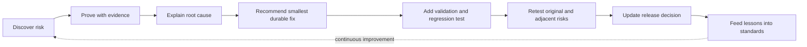
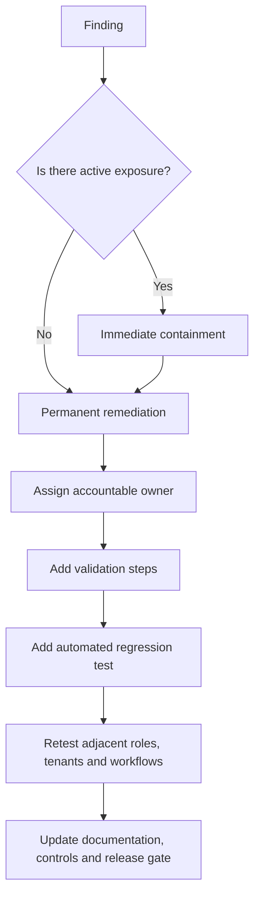
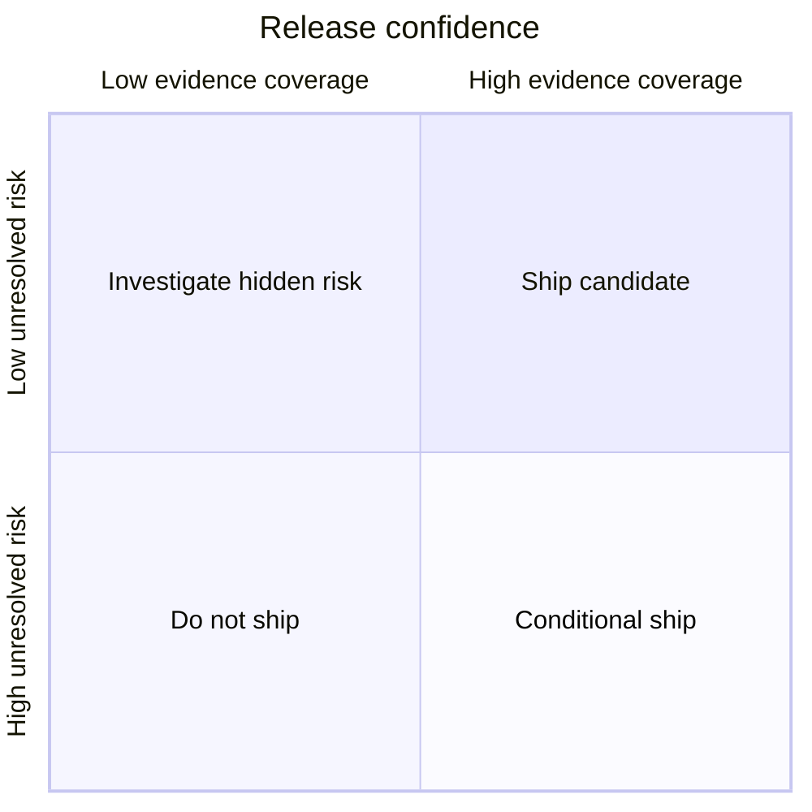

# How SaaS Audit Improves Product Quality

The audit does not stop at identifying defects. It connects each finding to measurable engineering, product, security and operational improvement.

## Quality transformation model

## Improvement dimensions

| Dimension | Audit contribution | Expected quality gain |
|---|---|---|
| Correctness | Tests positive, negative, boundary, interrupted and concurrent behavior | Fewer production defects and inconsistent records |
| Security | Verifies authentication, authorization, tenancy, inputs, outputs and business logic | Lower probability and impact of exploitable defects |
| Reliability | Reviews retries, queues, idempotency, races, recovery and graceful degradation | Fewer incidents and faster recovery |
| Maintainability | Finds duplication, unclear boundaries, dead code, oversized modules and hidden coupling | Safer changes and easier onboarding |
| Testability | Maps critical workflows to missing automated evidence | Better regression protection and release speed |
| Performance | Identifies slow queries, duplicate work, oversized assets and expensive paths | Faster user experience and lower infrastructure cost |
| Accessibility | Verifies keyboard, focus, semantics, contrast and responsive behavior | Broader usability and fewer exclusion barriers |
| Operability | Reviews logs, metrics, traces, alerts, runbooks, deployment and rollback | Faster detection and diagnosis |
| Privacy | Reviews collection, retention, masking, access and deletion | Reduced exposure and simpler formal assessments |
| AI safety | Reviews prompt, tool, memory, retrieval and rendering controls | Lower model-driven privilege and disclosure risk |

## From raw finding to durable improvement

## What the recommendations contain

Every material recommendation should include:

1. **Observed problem** — what failed and where.
2. **Business consequence** — customer, financial, regulatory, operational or reputational impact.
3. **Technical root cause** — the control, design or implementation gap.
4. **Immediate containment** — the fastest safe step that reduces active exposure.
5. **Permanent solution** — the smallest durable change at the correct layer.
6. **Implementation guidance** — stack-specific code, configuration or architecture direction when supported by evidence.
7. **Owner and effort** — accountable team and estimated size.
8. **Validation plan** — exact checks required to prove the fix.
9. **Regression protection** — automated test or control preventing recurrence.
10. **Residual risk** — what remains after remediation.

## Examples of quality-improving suggestions

### Authorization

**Problem:** a restricted API action is accessible to a standard user.

**Suggestions:** centralize policy evaluation, deny by default, enforce the permission server-side, scope the database query, add a role-action contract test and retest direct routes plus adjacent endpoints.

### Data integrity

**Problem:** duplicate submissions create repeated financial or workflow records.

**Suggestions:** introduce idempotency keys, a unique database constraint, a transaction boundary, retry-safe behavior, duplicate-submission UI feedback and concurrent integration tests.

### Maintainability

**Problem:** authorization logic is duplicated across controllers.

**Suggestions:** create one policy layer, remove divergent conditionals, document the permission model, require policy tests and add static checks for bypass patterns.

### Performance

**Problem:** a dashboard triggers N+1 database queries.

**Suggestions:** batch or join queries, add selective indexes, paginate large result sets, define a query budget, record tracing evidence and add a performance regression test.

### Accessibility

**Problem:** modal dialogs trap neither focus nor screen-reader context.

**Suggestions:** use a tested dialog primitive, move focus on open, restore focus on close, expose the title and description, support Escape and add automated plus keyboard-only tests.

## Quality score interpretation

A score is useful only when backed by coverage. The report must show both score and evidence completeness.

A high score with low coverage must not be presented as high confidence. Blocked or untested critical workflows can cap the release verdict regardless of the numeric score.
