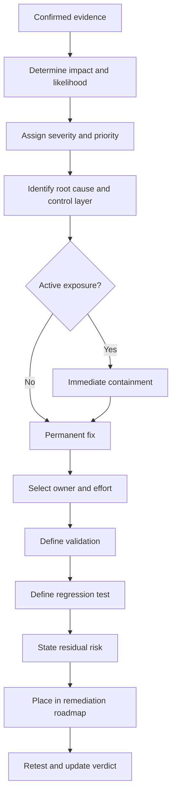
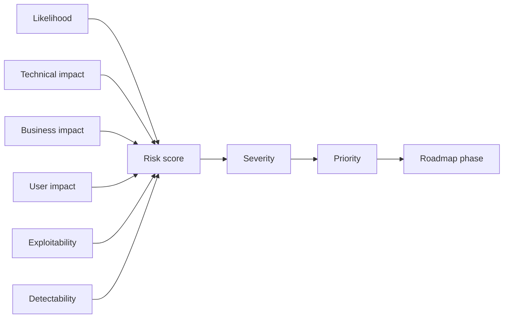

# Recommendation Engine

The recommendation engine converts evidence into an executable improvement roadmap. It does not produce generic advice detached from the discovered stack, risk or operating constraints.

## Recommendation decision flow



## Recommendation types

### 1. Immediate containment

Used when exposure is active or release risk is unacceptable. Examples include disabling a vulnerable route, revoking a leaked secret, restricting a bucket, blocking an unsafe role action or temporarily stopping a flawed workflow.

Containment is explicitly temporary. It must include an owner, expiration condition and follow-up permanent fix.

### 2. Code-level remediation

Targets implementation defects such as missing authorization, unsafe validation, output encoding, race conditions, error handling, excessive data exposure, insecure defaults or duplicated logic.

A good code recommendation identifies the correct enforcement layer and avoids merely hiding the problem in the UI.

### 3. Data and migration remediation

Targets missing constraints, unsafe schemas, inconsistent records, unscoped tenant queries, migration risks, retention gaps, backup weaknesses and restore failures.

Recommendations may include constraints, transactions, row-level policies, backfills, dry runs, expand-contract migrations, reconciliation queries and rollback or forward-fix plans.

### 4. Architecture remediation

Targets unclear boundaries, excessive coupling, duplicated policy logic, unsafe shared services, synchronous bottlenecks, unbounded background work and missing failure isolation.

Architecture suggestions must be proportionate. The skill does not recommend microservices, queues, caches or new platforms unless evidence and requirements justify them.

### 5. Test and quality remediation

Targets missing critical-path tests, poor coverage of roles or tenants, flaky tests, inadequate accessibility checks, absent performance budgets and gaps between source and runtime inventories.

Every Critical or High finding should produce an automated regression test where technically feasible.

### 6. Infrastructure and operational remediation

Targets CI/CD permissions, environment separation, deployment safety, rollback, observability, alerts, runbooks, capacity, backup, RTO/RPO and incident readiness.

### 7. Product and UX remediation

Targets confusing workflows, misleading actions, poor recovery, accessibility barriers, weak empty states, excessive steps, inconsistent components and risky destructive actions.

### 8. Governance remediation

Targets unclear ownership, undocumented exceptions, missing data classification, absent threat models, stale dependencies, undocumented APIs and release approvals without evidence.

## Prioritization model



Default roadmap phases:

| Phase | Target | Typical content |
|---|---|---|
| Immediate | Hours | Active exposure, credential revocation, access restriction, rollback |
| P0/P1 | Before release | Critical/High authorization, tenancy, integrity, migration and critical-workflow defects |
| Short term | Current or next sprint | Material Medium findings, test gaps, performance bottlenecks, reliability issues |
| Planned | Following releases | Low-risk quality, maintainability and UX improvements |
| Strategic | Roadmap | Architecture simplification, platform hardening, broader automation and maturity work |

## Recommendation quality rules

A recommendation is incomplete unless it:

- addresses the demonstrated root cause;
- acts at the correct trust boundary or control layer;
- is compatible with the discovered technology stack;
- explains implementation risk and migration impact;
- names an accountable owner or team;
- estimates effort using `XS`, `S`, `M`, `L` or `XL`;
- defines proof of completion;
- defines regression protection;
- states residual risk;
- avoids unnecessary technology or process.

## Example recommendation record

```json
{
  "finding_id": "AUTH-101",
  "severity": "High",
  "immediate": "Disable the affected export action for non-administrator roles until server-side authorization is deployed.",
  "permanent": "Enforce the export permission in the API policy layer and scope the export query by tenant and role.",
  "owner": "Backend Platform",
  "effort": "S",
  "validation": [
    "Repeat the original standard-user request and confirm a 403 response",
    "Verify administrators can export only their own tenant",
    "Test modified object and tenant identifiers"
  ],
  "regression_test": "Add role-by-tenant API contract tests for all export endpoints.",
  "residual_risk": "Existing exported files require an access review and expiry check."
}
```

## What the skill must not recommend

- hiding an unauthorized action only in the UI;
- disabling validation or security checks to make a pipeline pass;
- introducing complex infrastructure without demonstrated need;
- claiming compliance or certification from a limited audit;
- accepting Critical or High risk without explicit accountable authorization;
- marking an issue fixed based solely on a code diff;
- destructive production tests or uncontrolled load.
