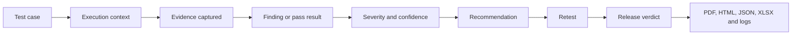
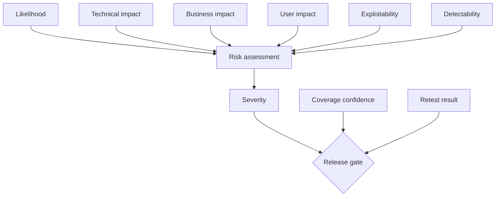
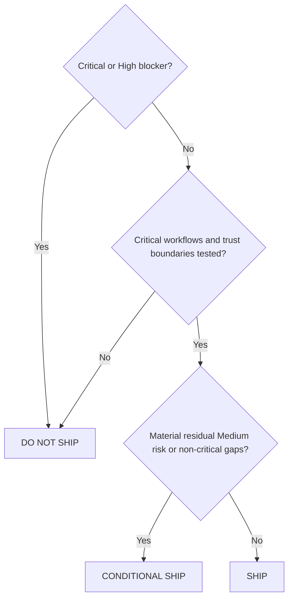

# Evidence, Scoring and Reporting

A SaaS audit report is trustworthy only when every conclusion can be traced to executed tests and preserved evidence.

## Evidence lifecycle



## Required output structure

```text
saas-audit-output/
├── reports/
│   ├── <app>_Holistic_SaaS_Audit_Report_<date>.pdf
│   ├── <app>_Holistic_SaaS_Audit_Report_<date>.html
│   └── <app>_Release_Verdict_<date>.md
├── data/
│   ├── <app>_Audit_Findings_<date>.json
│   ├── <app>_Detailed_Audit_Findings_<date>.xlsx
│   ├── <app>_RBAC_Matrix_<date>.xlsx
│   ├── coverage.json
│   └── evidence-index.json
├── evidence/<domain>/
├── logs/<app>_Audit_Execution_Log_<date>.md
└── manifest.json
```

## Evidence types

| Type | Example | Minimum metadata |
|---|---|---|
| Screenshot | Page, error, inaccessible control, leakage | URL, role, tenant, viewport, timestamp, issue ID |
| Browser log | Console exception or failed request | Page, action, timestamp, relevant message |
| API evidence | Request and redacted response | Method, route, role, tenant, status, correlation ID |
| Code evidence | File and relevant lines | Commit SHA, path, symbol or line range |
| Command output | Build, test, scan or migration output | Command, tool version, exit code, timestamp |
| Data evidence | Query result, policy or schema | Environment, object, masked values, read-only method |
| Infrastructure evidence | IaC or cloud setting | Resource, environment, configuration reference |

All evidence must redact passwords, tokens, cookies, personal data, financial data and confidential tenant information.

## Finding status

- `CONFIRMED` — reproduced with sufficient evidence.
- `PROBABLE` — strong evidence but incomplete confirmation.
- `OBSERVATION` — quality or design improvement without a confirmed defect.
- `BLOCKED` — required access, data or tool unavailable.
- `FALSE_POSITIVE` — investigated and rejected.
- `RETEST_PASS` — remediation verified.
- `RETEST_FAIL` — remediation did not resolve the issue.

## Severity

| Severity | Priority | Meaning | Default release effect |
|---|---|---|---|
| Critical | P0 | Immediate severe compromise, tenant leakage, auth bypass or material integrity loss | Do not ship |
| High | P1 | Major exploitable or operational risk with serious impact | Do not ship |
| Medium | P2 | Material defect needing scheduled remediation | Conditional depending on context |
| Low | P3 | Limited impact or lower-probability issue | Usually backlog or planned fix |
| Informational | P4 | Improvement, hygiene or documentation opportunity | No direct block |

## Risk reasoning

Risk considers likelihood, technical impact, business impact, user impact, exploitability and detectability. Numeric scores support prioritization but do not override release rules.



## Coverage confidence

Coverage must be shown beside the score. At minimum report:

- discovered surfaces;
- tested surfaces;
- passed, failed, blocked, not tested and not applicable counts;
- roles tested versus known roles;
- tenants tested;
- critical workflows tested;
- unavailable tools or permissions;
- code/runtime inventory mismatches.

A high score with low critical coverage is not a high-confidence result.

## Report structure

1. Cover and document control.
2. Executive summary.
3. Scope, authorization and limitations.
4. Product and architecture overview.
5. Methodology and tools.
6. Surface inventory and coverage.
7. Overall quality and risk score.
8. Severity distribution and risk heat map.
9. Authentication, RBAC and tenant matrices.
10. Critical user journeys.
11. Domain-level results.
12. Detailed findings with evidence.
13. Recommendation roadmap.
14. Retest results and residual risk.
15. Release verdict.
16. Evidence index and execution log.

## Finding anatomy

Every material finding must include:

- stable ID and concise title;
- status, domain, severity and priority;
- environment, affected roles and tenants;
- description, expected and actual behavior;
- exact reproduction steps;
- evidence references;
- likelihood and impact;
- root cause where supported;
- immediate containment;
- permanent fix;
- accountable owner and effort;
- validation procedure;
- automated regression test;
- retest status and residual risk.

## Release verdict



### DO NOT SHIP

Use when unresolved Critical/High risk, tenant leakage, auth bypass, exposed secrets, failed build or critical tests, unsafe migration, missing rollback, untested critical workflow or likely severe production failure remains.

### CONDITIONAL SHIP

Use when no Critical/High blocker remains but material Medium risk or non-critical coverage gaps have explicit owners, deadlines, monitoring and approved exceptions.

### SHIP

Use only when critical workflows, roles, tenant boundaries, migrations, rollback, monitoring and required quality/security checks pass with evidence.

Human release authorization remains required.
