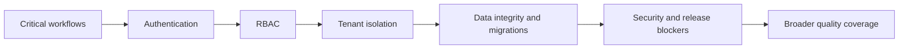

# Troubleshooting

## The client does not recognize the skill

1. Confirm the folder is named exactly `saas-audit`.
2. Confirm `SKILL.md` is at the root of that folder.
3. Confirm the YAML frontmatter begins on the first line and contains `name: saas-audit`.
4. Restart or reload the AI client.
5. Ask the client to read the skill explicitly by name.
6. For project installation, confirm the project was opened from the directory containing `.agents`, `.claude` or `.github`.

## Linked references are missing

The complete repository must be copied. Do not copy only `SKILL.md`. Re-run the installer or clone the repository again.

Required directories:

```text
assets/
docs/
references/
scripts/
```

## Permission denied on `install.sh`

```bash
chmod +x install.sh
./install.sh
```

Or run:

```bash
bash install.sh
```

## PowerShell blocks the installer

Use a process-only policy change:

```powershell
Set-ExecutionPolicy -Scope Process Bypass
.\install.ps1
```

Review the script before execution. Do not weaken machine-wide policy unnecessarily.

## The agent cannot run browser or terminal tests

The skill does not create permissions. Grant only the tools required for the authorized scope. Missing capabilities must be recorded as `BLOCKED`, not treated as passed.

A code-only audit can continue without browser access. A black-box audit can continue without source access. The report must explain the limitation.

## Credentials appear in logs or screenshots

Stop the affected test. Revoke or rotate exposed credentials where necessary, remove unsafe evidence, capture a redacted replacement and document the incident. Prefer environment variables and dedicated test accounts.

## Findings fail validation

Run:

```bash
python3 scripts/validate_findings.py path/to/findings.json
```

Common causes:

- findings file is not a JSON array;
- missing required fields;
- invalid severity or priority;
- empty reproduction or evidence arrays;
- malformed JSON.

Install optional full-schema validation:

```bash
python3 -m pip install jsonschema
```

The script provides a built-in fallback when `jsonschema` is unavailable.

## PDF generation fails

HTML output remains the portable source of truth. Install one supported renderer:

```text
wkhtmltopdf
weasyprint
chromium / google-chrome
```

Then run:

```bash
python3 scripts/render_report.py report.md --html report.html --pdf report.pdf
```

Do not claim a PDF exists unless the file was actually generated.

## Audit takes too long

Use risk-first execution:



Create one discovery inventory and reuse it across domains. Do not repeatedly crawl the same routes without a distinct test objective.

For a constrained engagement, use focused mode but preserve security, RBAC, tenancy, data and regression boundaries around the selected module.

## The score looks high but coverage is incomplete

Do not rely on the score alone. Review blocked and untested critical workflows, roles, tenants and trust boundaries. Low evidence coverage caps release confidence and can force `DO NOT SHIP`.

## GitHub Mermaid diagrams do not render

Confirm the code block begins with `mermaid`, uses supported Mermaid syntax and contains no tabs or malformed labels. Diagrams are supplemental; surrounding text must remain understandable without rendering.

## A recommendation feels generic

Require it to state evidence, root cause, correct control layer, immediate containment, permanent fix, owner, effort, validation, regression test and residual risk. Reject recommendations that simply say “improve security,” “add validation” or “write more tests.”
