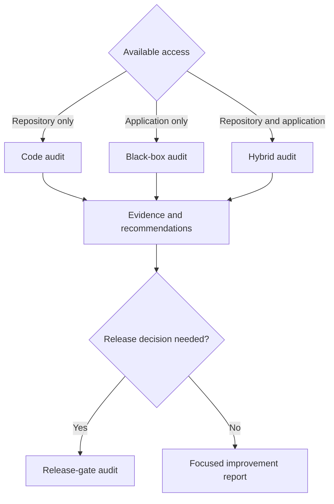

# Usage Guide and Prompt Library

## Recommended complete audit prompt

```text
Use the saas-audit skill to perform a complete hybrid pre-release audit of this repository and the authorized staging application.

Start by recording scope, environment, commit, roles, tenants, credentials source, restrictions and critical workflows. Build a complete inventory of code and runtime surfaces. Audit authentication, sessions, server-side RBAC, multi-tenant isolation, functional behavior, UI/UX, accessibility, application and API security, database integrity, storage, dependencies, CI/CD, infrastructure, reliability, observability, performance, privacy and any AI/LLM features.

Use at least two tenants and every available role. Run safe build, type, lint, test and scanning commands. Capture screenshots, network/console evidence, API evidence, code/configuration references and command output. Do not claim a test passed unless it was executed.

For each finding, explain expected versus actual behavior, reproduction, affected roles and tenants, technical and business impact, root cause, immediate containment, permanent remediation, owner, effort, validation, regression test and residual risk.

Retest fixes and adjacent trust boundaries. Generate the evidence pack and issue SHIP, CONDITIONAL SHIP or DO NOT SHIP. Do not perform destructive testing, uncontrolled load, production changes or data exfiltration.
```

## Audit modes



## Codebase-only audit

```text
Use saas-audit in code-audit mode for this repository. Do not modify application behavior. Inventory architecture, routes, APIs, data access, authorization, tenancy controls, migrations, dependencies, tests, CI/CD and infrastructure. Run available build, type-check, lint, tests and safe scans. Identify defects and missing evidence. Produce prioritized recommendations and explicitly mark all runtime-only checks BLOCKED.
```

## Black-box audit

```text
Use saas-audit in black-box mode for the authorized staging URL. Discover every accessible page and workflow. Test all supplied roles and two tenants through UI, direct URLs and APIs. Capture screenshots, console/network evidence and exact reproduction. Do not infer code-level root causes without evidence; mark them probable where appropriate.
```

## RBAC audit

```text
Use saas-audit to create an expected-versus-actual RBAC matrix. Test every role against view, list, search, create, update, delete, approve, assign, import, export, download, configure, invite, archive, restore, impersonate and sensitive-field access. Verify UI, direct routes and API enforcement. Treat front-end hiding as insufficient evidence.
```

## Multi-tenant isolation audit

```text
Use saas-audit to prove tenant isolation with Tenant A and Tenant B. Test records, identifiers, users, files, filenames, storage URLs, reports, exports, search, autocomplete, notifications, emails, webhooks, cache keys, CDN paths, logs, analytics, background jobs, search indexes, vector stores, branding and error messages. Stop immediately if real customer data could be exposed.
```

## Quality and maintainability audit

```text
Use saas-audit to assess code correctness, maintainability and engineering quality. Identify dead code, duplicated policy logic, oversized modules, weak boundaries, inconsistent error handling, missing tests, flaky tests, unsafe migrations, hidden coupling, performance bottlenecks and documentation gaps. For every suggestion, explain the expected quality gain, implementation effort, validation and regression protection.
```

## UI/UX and accessibility audit

```text
Use saas-audit to review every discovered page at desktop, tablet and mobile sizes. Test keyboard-only operation, focus, labels, semantics, contrast, zoom, modals, tables and dynamic announcements. Review navigation, action clarity, loading, empty, error, success and destructive states. Capture evidence and propose component-level improvements.
```

## API and database audit

```text
Use saas-audit to review API contracts, authentication, object/function authorization, validation, mass assignment, excessive exposure, pagination, rate limits, CORS, idempotency, replay, versioning and deprecated endpoints. Review database constraints, tenant scoping, RLS, transactions, retries, precision, time zones, migrations, backup and restore. Correlate API behavior with data integrity.
```

## AI/LLM audit

```text
Use saas-audit to audit all AI features. Test prompt injection, unsafe rendering, tool permission boundaries, confirmation for irreversible actions, RAG and vector isolation, tenant memory separation, untrusted uploaded documents, sensitive-data leakage, model failure handling and audit logging. Use adversarial but non-destructive prompts.
```

## Pre-release gate

```text
Use saas-audit in release-gate mode. Retest every Critical and High issue, critical workflow, role and tenant boundary. Verify build, tests, migrations, rollback, monitoring and incident ownership. Issue SHIP only when required evidence exists and no blocker remains. Explain every limitation that reduces release confidence.
```

## Initialize the evidence workspace

```bash
python3 scripts/init_audit.py "Example SaaS" --environment staging
```

## Validate findings

```bash
python3 scripts/validate_findings.py saas-audit-output/<workspace>/data/findings.json
```

## Render report

```bash
python3 scripts/render_report.py report.md --html report.html --pdf report.pdf --title "Example SaaS Audit"
```

## How to supply context efficiently

Provide these items when available:

- repository path or URL;
- staging URL and environment name;
- application purpose and critical workflows;
- roles and expected permissions;
- two test tenants;
- secret source, never plaintext in committed files;
- compliance or data-classification expectations;
- exclusions and production restrictions;
- release date and release-blocking policy.

Missing inputs do not stop all work. The skill continues with the highest safe coverage and marks affected checks `BLOCKED` or `NOT TESTED`.
