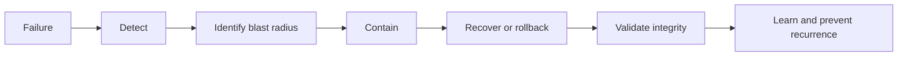

# Data, API, Infrastructure and Reliability

## API review

Inventory REST, GraphQL, RPC, WebSocket, SSE and webhook interfaces. Test:

- authentication and token handling;
- object-level and function-level authorization;
- tenant scoping;
- request schemas and unknown fields;
- mass assignment and excessive data exposure;
- pagination and query limits;
- content types, CORS and caching;
- idempotency, replay and duplicate requests;
- versioning and deprecated endpoints;
- error consistency and sensitive disclosure;
- timeout, retry and downstream failure behavior.

Correlate runtime behavior with source contracts and database access. Flag undocumented, orphaned and unreachable interfaces.

## Database integrity

Review:

- primary, foreign, unique and check constraints;
- nullability, defaults and generated values;
- numeric precision, currency and rounding;
- time zones, date boundaries and daylight-saving behavior;
- transactions and partial-write prevention;
- retry safety and idempotency;
- concurrent updates and optimistic/pessimistic locking;
- soft delete, restore and referential integrity;
- tenant predicates and row-level security;
- sensitive-field encryption and masking;
- query plans, indexes and N+1 patterns.

Critical business invariants should be enforced as close to the data as practical, not only in the UI.

## Migrations

For each material migration review forward safety, deployment order, backward compatibility, locks, table rewrites, backfill strategy, data validation, rollback or forward-fix, application version compatibility and recovery from partial execution.

Prefer expand-contract migrations for risky schema changes. Test on production-like volume when safe and authorized.

## Storage, cache and search

Check authorization, tenant scoping, object naming, signed URL lifetime, public access, encryption, lifecycle, deletion and restore for file/object storage.

Include tenant, role and relevant policy version in cache/search keys. Test stale authorization, cache poisoning, cross-tenant search results, CDN paths and invalidation behavior.

## Jobs, queues, cron and webhooks

Review:

- idempotency and deduplication;
- retries, backoff and retry budgets;
- poison messages and dead-letter handling;
- tenant context propagation;
- ordering assumptions;
- cron overlap and leader election;
- webhook signatures, replay windows and delivery logs;
- partial failure, compensation and reconciliation;
- observability and manual recovery.

## Dependencies and supply chain

Check lockfiles, vulnerable packages, transitive risk, abandoned libraries, package provenance, install scripts, licenses, SBOM readiness, secret leakage and update policy.

Recommendations should prioritize reachable and exploitable risk, not raw vulnerability counts alone.

## CI/CD

Review workflow permissions, protected branches and environments, required checks, secret exposure, untrusted fork behavior, artifact integrity, dependency caching, deployment approval, environment separation, rollback and post-deployment smoke tests.

Never recommend weakening required checks to achieve a green pipeline.

## Infrastructure and cloud

Review authorized IaC and cloud settings for:

- public exposure and network boundaries;
- identity and least privilege;
- secret management;
- encryption and key ownership;
- logging and audit trails;
- environment separation;
- container users, capabilities and image provenance;
- autoscaling, quotas and cost controls;
- DNS, TLS, CDN and WAF configuration;
- backup, restore and regional recovery.

## Observability

A critical workflow should expose enough telemetry to answer:

- what failed;
- which user, role and tenant context was involved without leaking sensitive data;
- where time was spent;
- which dependency contributed;
- whether the failure is isolated or systemic;
- what operator action is required.

Review structured logs, correlation IDs, metrics, traces, dashboards, alerts, error tracking, ownership and runbooks.

## Resilience and recovery

Review graceful degradation, dependency timeouts, circuit breakers where justified, retry storms, capacity limits, failure isolation, backup restore, RTO, RPO, disaster recovery and incident procedures.

## Performance

Use safe, authorized tests only. Measure page and API latency, slow queries, duplicate requests, bundle size, images, search, exports, uploads and critical background work. Never run uncontrolled load against production.

Recommendations may include query batching, indexes, pagination, streaming, caching with correct isolation, compression, deferred work and performance budgets.

## Privacy and retention

Review data minimization, purpose, consent, access, correction, export, deletion, masking, retention, backup retention, logs, browser storage and third-party processing. Record gaps as compliance readiness issues, not legal conclusions.
