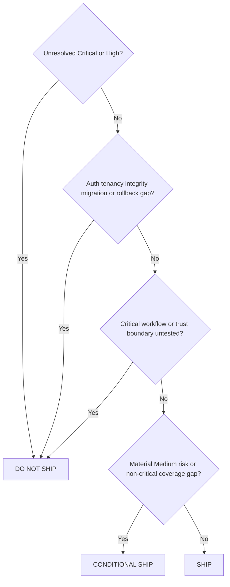

# Evidence, Recommendations and Release Gates

## Evidence before claims

A pass, finding, score or release verdict must be traceable to executed work. Never fabricate screenshots, logs, commands, test output or compliance conclusions.

## Evidence record

For each test capture:

- test or finding ID;
- timestamp and environment;
- repository commit or deployment version;
- role and tenant;
- URL, endpoint, component, job or data object;
- input and preconditions;
- expected and actual behavior;
- evidence type and relative reference;
- redaction status;
- test status and limitation.

## Finding confidence

- `CONFIRMED`: reproduced with sufficient evidence.
- `PROBABLE`: strong evidence but missing one confirmation element.
- `OBSERVATION`: improvement without a confirmed defect.
- `BLOCKED`: access, environment, data or tool prevented testing.
- `FALSE_POSITIVE`: investigated and rejected.

## Severity defaults

- **Critical/P0**: active or easily exploitable severe compromise, cross-tenant exposure, auth bypass, major integrity loss or unsafe irreversible release.
- **High/P1**: serious exploitable or operational risk requiring remediation before release.
- **Medium/P2**: material risk with bounded impact or mitigation.
- **Low/P3**: limited impact, difficult exploitation or quality issue.
- **Informational/P4**: hygiene, documentation or strategic improvement.

Severity can be raised by sensitive data, privileged users, wide tenant blast radius, irreversible operations, weak detectability or easy exploitation.

## Recommendation structure

Every material finding should produce:

1. immediate containment;
2. permanent root-cause remediation;
3. stack-compatible implementation direction;
4. accountable owner;
5. effort estimate;
6. target milestone;
7. validation procedure;
8. automated regression test;
9. retest result;
10. residual risk.

Do not recommend hiding controls in the UI, weakening tests, introducing unjustified architecture or accepting release blockers without explicit accountable authorization.

## Retest rules

Retest:

- the exact original reproduction;
- alternate identifiers and malformed values;
- adjacent roles and tenants;
- related routes, APIs, files, jobs and reports;
- likely regression surfaces;
- the new automated test where available.

A code diff alone is not verification.

## Coverage-aware scoring

Scores must be accompanied by coverage. Critical blocked or untested areas cap release confidence.

Recommended report metrics:

- total discovered and tested surfaces;
- pass, fail, blocked, not tested and not applicable;
- critical workflows tested;
- roles and tenants tested;
- severity distribution;
- confirmed versus probable findings;
- retest pass rate;
- unresolved residual risk;
- evidence completeness.

## Release gate

### DO NOT SHIP

Default when any of these remains:

- unresolved Critical or High security, authorization, tenancy or integrity issue;
- authentication or authorization bypass;
- cross-tenant data or metadata leakage;
- exposed secret or private key;
- failed build or critical tests;
- unsafe migration or material data-loss risk;
- missing rollback or forward-fix for a material change;
- untested critical workflow or trust boundary;
- likely severe production failure without adequate detection or recovery.

### CONDITIONAL SHIP

Allowed only when no Critical/High blocker remains and every material residual risk has:

- an accountable owner;
- a target date;
- approved exception;
- monitoring or containment;
- explicit customer and operational impact;
- rollback or stop condition.

### SHIP

Requires evidence that critical workflows, roles, tenant boundaries, migrations, rollback, monitoring and required quality/security checks passed.

The skill recommends; a human release owner authorizes.

## Report integrity

The final report must state scope, authorization, limitations, tested environments, tools, dates, commit/deployment, coverage and blocked work. It must not claim penetration-test certification, legal compliance, zero risk or 100% coverage.
