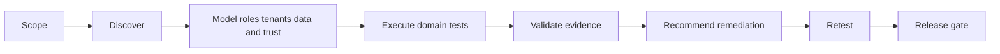

# Execution Playbook

## Objective

Run a repeatable, non-destructive audit that maximizes useful coverage, preserves evidence and produces a defensible release recommendation.

## Phase model



## 1. Scope and authorization

Record application, repository, environment, commit or deployment version, authorization reference, included and excluded systems, production restrictions, accounts, tenants, tools, time window and output location.

Use only authorized systems. Do not perform denial-of-service, destructive exploitation, persistence, credential stuffing, uncontrolled load or data exfiltration.

## 2. Initialize workspace

Use:

```bash
python3 scripts/init_audit.py "Application Name" --environment staging
```

Record exact commands and tool versions in the execution log. Prefix created records with `AUDIT_TEST_` and track cleanup.

## 3. Discovery

Inventory source and runtime surfaces before testing:

- routes, pages, menus, tabs and hidden paths;
- forms, tables, filters, reports, uploads, downloads, imports and exports;
- APIs, GraphQL, WebSockets, SSE, webhooks, queues and cron;
- roles, permissions, tenants, administrators, service accounts and impersonation;
- schemas, policies, functions, migrations, storage, cache and search;
- dependencies, CI/CD, IaC, containers, cloud resources and integrations;
- AI prompts, models, tools, knowledge sources, RAG and vector stores.

Reconcile source and runtime inventories. Flag orphaned, hidden, undocumented and unreachable surfaces.

## 4. Coverage ledger

Create a test record for every discovered surface and critical trust boundary. Use:

- `PASS` — executed and expected behavior observed;
- `FAIL` — executed and defect confirmed;
- `BLOCKED` — missing access, data, environment or tool;
- `NOT_TESTED` — skipped with reason;
- `NOT_APPLICABLE` — feature absent.

Never replace `BLOCKED` or `NOT_TESTED` with an assumed pass.

## 5. Execution order

1. Read repository instructions and architecture.
2. Preserve branch, commit and lockfiles.
3. Run canonical build, type, lint and test commands.
4. Run safe secrets, dependency, static, license and infrastructure checks when tools exist.
5. Map roles, tenants and expected permissions.
6. Test critical user journeys first.
7. Test authentication and sessions.
8. Test server-side RBAC through UI, direct route and API.
9. Test two-tenant isolation across every shared subsystem.
10. Test functional edge cases, accessibility and responsive states.
11. Test API, database, storage, integrations and background work.
12. Review deployment, rollback, observability, backup and recovery.
13. Capture evidence immediately after reproduction.
14. Validate findings and calculate coverage.
15. Produce recommendations, retest and issue verdict.

## 6. Evidence discipline

For each executed test record environment, role, tenant, URL or endpoint, input, expected behavior, actual behavior, timestamp and evidence references. Redact sensitive values.

Create findings only when supported. Distinguish confirmed, probable, observation, blocked and false positive.

## 7. Stopping conditions

Stop an individual test when it risks availability, integrity, privacy, cost or real customer data. Record the reason and mark remaining coverage blocked.

## 8. Completion

Before issuing the verdict confirm:

- all discovered surfaces have a status;
- critical workflows and trust boundaries have evidence;
- every evidence reference resolves;
- findings JSON validates;
- secrets and sensitive data are redacted;
- severity, recommendations and verdict are internally consistent;
- blocked and skipped tests are explicit;
- report, data, evidence and logs are present.
