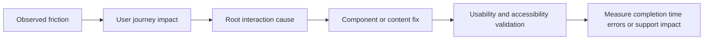

# Functional Quality, UX and Accessibility

## Functional test model

For every critical workflow test:

- normal success;
- invalid and malformed input;
- minimum, maximum and boundary values;
- missing required fields;
- duplicate submission;
- interrupted navigation or refresh;
- slow network and timeout;
- retry and idempotency;
- concurrent updates and stale data;
- cancellation, rollback and recovery;
- unauthorized roles and wrong tenants.

## Forms and data entry

Review labels, defaults, help, validation timing, server-side validation, field dependencies, date/time and currency behavior, internationalization, copy/paste, autofill, draft preservation and error recovery.

Recommendations should prefer clear prevention over late failure and preserve user work where safe.

## Tables, search and reporting

Test sorting, filtering, pagination, selection, bulk actions, column visibility, empty states, loading, errors, exports, permissions, large datasets and responsive behavior.

Check that totals, filters and exported data match the visible and authorized dataset.

## Navigation and interaction

Review information architecture, consistent labels, breadcrumbs, back behavior, deep links, refresh, unsaved changes, primary and secondary actions, destructive actions and first-time discoverability.

## UI states

Every important component should have deliberate:

- default;
- hover and active;
- focus;
- disabled;
- loading;
- empty;
- error;
- success;
- offline or degraded;
- read-only;
- permission-denied states.

## Responsive quality

Test representative desktop, tablet and mobile viewports. Look for clipped content, overlapping controls, horizontal scrolling, hidden actions, unusable tables, fixed elements covering content and touch targets that are too small.

## Accessibility

Review WCAG 2.2 readiness without claiming certification.

Test:

- keyboard-only navigation and operation;
- logical focus order and visible focus;
- focus placement and restoration for dialogs;
- native semantic controls before ARIA;
- headings, landmarks and page titles;
- programmatic labels, descriptions and errors;
- status and error announcements;
- contrast and non-color indicators;
- zoom and reflow;
- accessible names for icons and buttons;
- modal, menu, combobox and tab behavior;
- accessible tables and forms;
- touch target size;
- reduced motion where relevant.

## Compatibility

When scope permits, test supported browsers, operating systems, input methods, locale, time zone and display scaling. Record unsupported combinations rather than assuming parity.

## UX recommendation framework

Each UX recommendation should explain:

- affected user and task;
- observed friction or error;
- expected behavior;
- smallest component, content or workflow change;
- accessibility implications;
- validation method;
- expected effect on completion, errors or support demand.

## Common quality suggestions

- standardize repeated UI patterns through a shared component library;
- replace ambiguous icons with labels or accessible names;
- preserve drafts during recoverable failures;
- use specific, actionable error messages;
- prevent duplicate actions and show progress;
- separate dangerous actions and require proportionate confirmation;
- make permission-denied states explicit rather than silently hiding context;
- add keyboard and screen-reader regression tests to critical workflows;
- test responsive states in CI with visual or browser automation.
