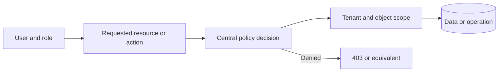

# Security, RBAC and Multi-Tenant Isolation

## Security operating rule

Use the minimum non-destructive proof required. Do not perform denial-of-service, uncontrolled load, persistence, credential stuffing, destructive exploitation or data exfiltration.

## Authentication

Test:

- valid, invalid, locked, disabled and unverified users;
- password policy and reset-token lifetime, reuse and invalidation;
- MFA enrollment, challenge, recovery and bypass resistance;
- login throttling, account lockout and abuse controls;
- session fixation, rotation, idle timeout and absolute timeout;
- logout and server-side revocation;
- session behavior after password, email, role or tenant change;
- secure cookie attributes and browser storage;
- OAuth/OIDC state, nonce, callback and account-linking behavior where applicable.

## Server-side authorization

For each role-action pair test UI, direct route and API access. Cover view, list, search, create, update, delete, approve, assign, import, export, download, configure, invite, archive, restore, impersonate and sensitive fields.

Look for:

- horizontal privilege escalation between users;
- vertical escalation into privileged roles;
- object-level authorization failures;
- function-level authorization failures;
- client-only permission checks;
- stale permissions after role changes;
- mass assignment of role, tenant or ownership fields;
- support or impersonation paths without auditability.

## Tenant isolation

Use at least two test tenants when available. Test cross-tenant access and disclosure through:

- predictable and modified object identifiers;
- list, detail, search and autocomplete;
- files, filenames, signed URLs, storage buckets and CDN paths;
- exports, reports and scheduled reports;
- notifications, email, templates and webhooks;
- cache keys, sessions and shared state;
- logs, analytics, metrics and error messages;
- jobs, queues, cron and retries;
- search indexes, RAG, embeddings and vector stores;
- branding, domains, logos and white-label configuration.

No tenant should learn another tenant's existence, name, identifiers, users, branding, volumes, filenames or configuration unless the product contract explicitly requires it.

Treat confirmed cross-tenant exposure as Critical by default.

## Input and output security

Safely review:

- injection into SQL, document queries, commands, templates and expressions;
- reflected, stored and DOM-based XSS;
- CSRF on state-changing browser operations;
- open redirects and untrusted URL handling;
- SSRF indicators and outbound request controls;
- path traversal and file-name manipulation;
- unsafe deserialization and parser behavior;
- output encoding and content security policy;
- error, stack trace, source map and debug disclosure.

## File handling

Check extension, content type, magic bytes, size, name, path, authorization, malware scanning where expected, processing isolation, download headers, signed URL expiry and tenant scoping.

## API abuse resistance

Test missing or malformed authentication, object/function authorization, rate limits, pagination limits, schema validation, unknown fields, mass assignment, excessive data, replay, idempotency, CORS and content types.

## Secrets and cryptography

Search authorized source and configuration for secrets, private keys, tokens, credentials, debug values and unsafe examples. Review secret rotation, environment separation, encryption usage, key ownership and client-side exposure.

Do not expose secret values in findings. Record only redacted evidence and rotation requirements.

## AI and agent security

For AI-enabled products test:

- direct and indirect prompt injection;
- untrusted documents and retrieved content;
- tool argument validation and permission boundaries;
- confirmation before irreversible or high-impact actions;
- model output rendered as HTML, Markdown, SQL or commands;
- tenant separation in memory, RAG and vector stores;
- sensitive prompt, response and tool-call logging;
- excessive model access to secrets or internal systems;
- failure, refusal and fallback behavior.

## Default recommendations

- centralize authorization and deny by default;
- scope every query, cache key, object path and job by tenant;
- rotate sessions and secrets after privilege or credential changes;
- validate inputs at trust boundaries and encode outputs by context;
- add role-by-action and tenant-by-object automated tests;
- keep sensitive data out of client code, URLs, logs and errors;
- require confirmation and least privilege for AI tool execution;
- preserve audit logs for privileged and support actions.
